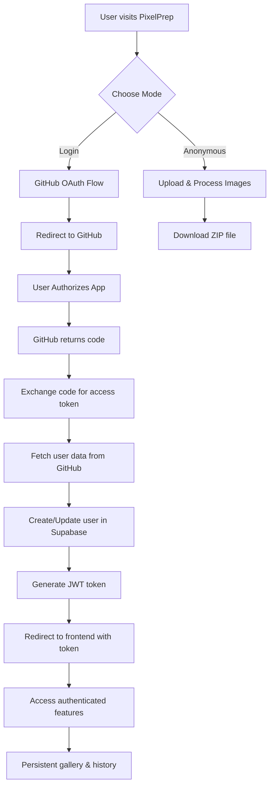

# Authentication System Documentation

## Overview

PixelPrep implements a dual-mode authentication system that supports both anonymous and authenticated users:

- **Anonymous Users**: Instant processing with temporary memory-based storage
- **Authenticated Users**: Persistent storage, image gallery, and optimization history via GitHub OAuth

## Architecture

### Authentication Flow



### Tech Stack

- **OAuth Provider**: GitHub OAuth Apps
- **Token Format**: JWT (HS256 algorithm)
- **Token Storage**: Frontend localStorage/sessionStorage
- **Backend Security**: HTTPBearer with FastAPI Depends
- **Database**: Supabase PostgreSQL with Row Level Security (RLS)

## Configuration

### Environment Variables

```bash
# Required for authentication features
GITHUB_CLIENT_ID=your_github_client_id
GITHUB_CLIENT_SECRET=your_github_client_secret
JWT_SECRET_KEY=your_jwt_secret_key
JWT_ALGORITHM=HS256
JWT_ACCESS_TOKEN_EXPIRE_MINUTES=30

# Database (Supabase)
SUPABASE_URL=https://your-project.supabase.co
SUPABASE_ANON_KEY=your_anon_key
SUPABASE_SERVICE_ROLE_KEY=your_service_role_key

# Optional
FRONTEND_URL=https://your-frontend-domain.com
```

### GitHub OAuth App Setup

1. Go to GitHub Settings → Developer settings → OAuth Apps
2. Create new OAuth App with:
   - **Application name**: PixelPrep
   - **Homepage URL**: `https://your-domain.com`
   - **Authorization callback URL**: `https://your-api-domain.com/auth/github/callback`
3. Copy Client ID and Client Secret to environment variables

## API Endpoints

### Authentication Endpoints

#### `GET /auth/github/login`
Initiate GitHub OAuth flow.

**Response:**
```json
{
  "auth_url": "https://github.com/login/oauth/authorize?client_id=...",
  "state": "random_state_string"
}
```

**Usage:**
```javascript
// Frontend redirects user to auth_url
window.location.href = response.auth_url;
```

#### `GET /auth/github/callback`
Handle GitHub OAuth callback.

**Parameters:**
- `code`: Authorization code from GitHub
- `state`: State parameter for CSRF protection

**Response:**
```json
{
  "access_token": "jwt_token_here",
  "token_type": "bearer",
  "expires_in": 1800,
  "user": {
    "id": "user_uuid",
    "email": "user@example.com",
    "name": "User Name",
    "avatar_url": "https://github.com/avatar.jpg",
    "github_username": "username"
  }
}
```

#### `GET /auth/me`
Get current authenticated user information.

**Headers:**
```
Authorization: Bearer <jwt_token>
```

**Response:**
```json
{
  "id": "user_uuid",
  "email": "user@example.com", 
  "display_name": "User Name",
  "avatar_url": "https://github.com/avatar.jpg",
  "github_username": "username",
  "created_at": "2024-01-01T00:00:00Z"
}
```

#### `POST /auth/logout`
Logout user (client-side token removal).

**Response:**
```json
{
  "message": "Successfully logged out"
}
```

#### `GET /auth/health`
Check authentication system health.

**Response:**
```json
{
  "status": "healthy",
  "github_oauth": true,
  "jwt_configured": true,
  "supabase_connected": true
}
```

## Database Schema

### Tables

#### `profiles`
User profile information linked to Supabase auth.users.

```sql
CREATE TABLE profiles (
  id UUID REFERENCES auth.users(id) PRIMARY KEY,
  email TEXT NOT NULL,
  display_name TEXT,
  avatar_url TEXT,
  github_username TEXT,
  subscription_tier TEXT DEFAULT 'free',
  created_at TIMESTAMP WITH TIME ZONE DEFAULT NOW(),
  updated_at TIMESTAMP WITH TIME ZONE DEFAULT NOW()
);
```

#### `images`
Original uploaded images.

```sql
CREATE TABLE images (
  id UUID DEFAULT gen_random_uuid() PRIMARY KEY,
  user_id UUID REFERENCES profiles(id) ON DELETE CASCADE,
  original_filename TEXT NOT NULL,
  storage_path TEXT NOT NULL,
  original_size BIGINT NOT NULL,
  original_dimensions TEXT NOT NULL,
  uploaded_at TIMESTAMP WITH TIME ZONE DEFAULT NOW(),
  metadata JSONB DEFAULT '{}'::jsonb
);
```

#### `processed_images`
Optimized image versions.

```sql
CREATE TABLE processed_images (
  id UUID DEFAULT gen_random_uuid() PRIMARY KEY,
  image_id UUID REFERENCES images(id) ON DELETE CASCADE,
  user_id UUID REFERENCES profiles(id) ON DELETE CASCADE,
  preset_name TEXT NOT NULL,
  storage_path TEXT NOT NULL,
  public_url TEXT,
  file_size_bytes BIGINT NOT NULL,
  processed_at TIMESTAMP WITH TIME ZONE DEFAULT NOW(),
  metadata JSONB DEFAULT '{}'::jsonb
);
```

### Row Level Security (RLS)

All tables have RLS policies ensuring users can only access their own data:

```sql
-- Enable RLS
ALTER TABLE profiles ENABLE ROW LEVEL SECURITY;
ALTER TABLE images ENABLE ROW LEVEL SECURITY;
ALTER TABLE processed_images ENABLE ROW LEVEL SECURITY;

-- Policies (users can only access their own data)
CREATE POLICY "Users can view own profile" ON profiles
  FOR SELECT USING (auth.uid() = id);

CREATE POLICY "Users can update own profile" ON profiles
  FOR UPDATE USING (auth.uid() = id);

CREATE POLICY "Users can view own images" ON images
  FOR ALL USING (auth.uid() = user_id);

CREATE POLICY "Users can view own processed images" ON processed_images
  FOR ALL USING (auth.uid() = user_id);
```

## Frontend Integration

### Token Management

```typescript
// Store JWT token
localStorage.setItem('pixelprep_token', token);

// Include token in API requests
const headers = {
  'Authorization': `Bearer ${localStorage.getItem('pixelprep_token')}`,
  'Content-Type': 'application/json'
};

// Check token expiration
function isTokenExpired(token: string): boolean {
  try {
    const payload = JSON.parse(atob(token.split('.')[1]));
    return Date.now() >= payload.exp * 1000;
  } catch {
    return true;
  }
}
```

### Protected Routes

```typescript
// Route protection in React
function ProtectedRoute({ children }: { children: React.ReactNode }) {
  const token = localStorage.getItem('pixelprep_token');
  
  if (!token || isTokenExpired(token)) {
    return <LoginPrompt />;
  }
  
  return <>{children}</>;
}
```

### User Gallery Integration

```typescript
// Fetch user's uploaded images
async function fetchUserImages(limit = 20, offset = 0) {
  const response = await fetch(`/api/optimize/images?limit=${limit}&offset=${offset}`, {
    headers: {
      'Authorization': `Bearer ${localStorage.getItem('pixelprep_token')}`
    }
  });
  
  return response.json();
}
```

## Security Features

### JWT Token Security
- **Algorithm**: HS256 (HMAC with SHA-256)
- **Expiration**: 30 minutes (configurable)
- **Secret**: Environment variable (min 32 characters)
- **Claims**: `sub` (user ID), `email`, `exp` (expiration)

### CORS Configuration
```python
# Production origins
origins = [
    "https://third-south-capital.github.io",
    "https://third-south-capital.github.io/pixelprep",
    "http://localhost:3000",  # React dev
    "http://localhost:5173"   # Vite dev
]
```

### Row Level Security
- All database operations are scoped to the authenticated user
- Users cannot access other users' images or data
- Supabase RLS policies enforce data isolation

### Rate Limiting
- Anonymous users: Limited by IP-based rate limiting
- Authenticated users: Higher rate limits for uploads
- Production deployment includes Render.com built-in DDoS protection

## Error Handling

### Common Error Codes

#### `401 Unauthorized`
```json
{
  "detail": "Not authenticated"
}
```
**Causes:**
- Missing Authorization header
- Invalid JWT token
- Expired JWT token

#### `403 Forbidden`
```json
{
  "detail": "Access denied"
}
```
**Causes:**
- Valid token but insufficient permissions
- Attempting to access other user's resources

#### `500 Internal Server Error`
```json
{
  "detail": "GitHub OAuth not configured"
}
```
**Causes:**
- Missing GitHub OAuth credentials
- Database connection issues
- Invalid JWT secret

## Testing

### Authentication Test Coverage

The test suite includes comprehensive coverage:

```bash
# Run authentication tests
uv run pytest backend/src/api/auth--test.py -v

# Test classes covered:
# - TestAuthEndpoints: Basic endpoint functionality
# - TestJWTFunctions: Token creation and verification  
# - TestGitHubCallback: OAuth callback handling
```

### Test Scenarios
- ✅ GitHub OAuth login flow
- ✅ JWT token creation and validation
- ✅ Protected route access control
- ✅ User profile creation/retrieval
- ✅ Error handling for invalid tokens
- ✅ CORS configuration validation

## Monitoring & Debugging

### Health Checks
```bash
# Check authentication system status
curl https://pixelprep.onrender.com/auth/health

# Verify GitHub OAuth configuration
curl https://pixelprep.onrender.com/auth/github/login
```

### Logging
```python
# Authentication events are logged
import logging
logger = logging.getLogger(__name__)

# User login
logger.info(f"User {user_id} authenticated via GitHub")

# Token validation
logger.warning(f"Invalid token attempt from IP {client_ip}")
```

### Common Issues & Solutions

#### Issue: "GitHub OAuth not configured"
**Solution:** Verify `GITHUB_CLIENT_ID` and `GITHUB_CLIENT_SECRET` environment variables

#### Issue: "Could not validate credentials"
**Solution:** Check JWT_SECRET_KEY and token expiration

#### Issue: "Supabase connection failed"
**Solution:** Verify `SUPABASE_URL` and `SUPABASE_SERVICE_ROLE_KEY`

#### Issue: CORS errors in browser
**Solution:** Ensure frontend domain is in CORS origins list

## Production Deployment

### Environment Checklist
- [ ] GitHub OAuth app configured with production callback URL
- [ ] JWT_SECRET_KEY set to secure random value (32+ characters)
- [ ] Supabase project created with RLS policies
- [ ] CORS origins include production frontend domain
- [ ] Environment variables set in hosting platform
- [ ] SSL certificates configured for HTTPS

### Production URLs
- **Frontend**: https://third-south-capital.github.io/pixelprep/
- **Backend**: https://pixelprep.onrender.com/
- **OAuth Callback**: https://pixelprep.onrender.com/auth/github/callback

## Future Enhancements

### Planned Features
- **Multi-provider OAuth**: Google, Twitter integration
- **API Keys**: Machine-to-machine authentication
- **Role-based Access**: Admin, premium user roles
- **Session Management**: Revoke tokens, active sessions
- **Audit Logging**: Track all authentication events

### Security Improvements
- **Refresh Tokens**: Longer-lived authentication
- **Rate Limiting**: User-specific rate limits
- **2FA Support**: TOTP integration
- **OAuth State Validation**: Enhanced CSRF protection

---

*Last Updated: 2025-09-12*  
*Version: 1.0.0*