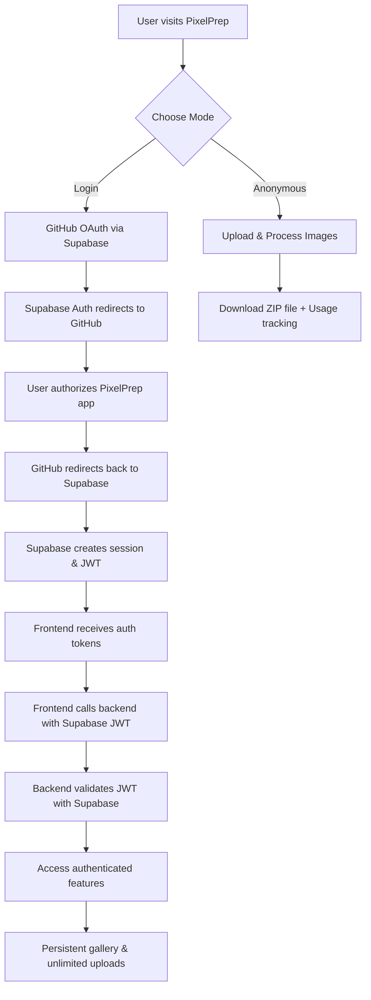

# Authentication System Documentation

## Overview

PixelPrep implements a **dual-mode authentication system** that supports both anonymous and authenticated users using **Supabase Auth** with **GitHub OAuth**:

- **Anonymous Users**: Instant processing with temporary memory-based storage (1 free optimization)
- **Authenticated Users**: Unlimited processing, persistent storage, image gallery, and optimization history

## Architecture

### Authentication Flow



### Tech Stack

- **Authentication Provider**: Supabase Auth
- **OAuth Provider**: GitHub OAuth Apps
- **Frontend Auth**: Supabase JavaScript client with auto-refresh
- **Backend Validation**: Supabase JWT verification
- **Database**: Supabase PostgreSQL with Row Level Security (RLS)
- **Token Format**: Supabase JWT tokens (auto-managed)

## Configuration

### Environment Variables

#### Frontend (`.env`)
```bash
# Supabase Configuration
VITE_SUPABASE_URL=https://zhxhuzcbsvumopxnhfxm.supabase.co
VITE_SUPABASE_ANON_KEY=eyJhbGciOiJIUzI1NiIsInR5cCI6IkpXVCJ9...
```

#### Backend (`.env`)
```bash
# Supabase Configuration
SUPABASE_URL=https://zhxhuzcbsvumopxnhfxm.supabase.co
SUPABASE_SERVICE_KEY=eyJhbGciOiJIUzI1NiIsInR5cCI6IkpXVCJ9...
SUPABASE_ANON_KEY=eyJhbGciOiJIUzI1NiIsInR5cCI6IkpXVCJ9...

# GitHub OAuth (for Supabase)
GITHUB_CLIENT_ID=Ov23lihITbQ3YIuYA2Ko
GITHUB_CLIENT_SECRET=7edd265ac7ee65586fe78e356df8540e24f33651
```

#### GitHub Actions (Secrets)
```bash
# Set via GitHub CLI
gh secret set VITE_SUPABASE_ANON_KEY --body "eyJhbGciOiJIUzI1NiIsInR5cCI6IkpXVCJ9..."
```

### Supabase Setup

1. **Create Supabase Project**: https://supabase.com/dashboard
2. **Configure GitHub OAuth**:
   - Go to Authentication → Settings → Auth Providers
   - Enable GitHub provider
   - Add GitHub Client ID and Secret
   - Set Site URL: `https://third-south-capital.github.io/pixelprep/`
   - Add Redirect URL: `https://third-south-capital.github.io/pixelprep/`

## Current Working Implementation

### Frontend Authentication Service

**File: `frontend/src/services/auth.ts`**

```typescript
import { supabase } from './supabase';

class AuthService {
  // GitHub OAuth sign-in
  async signInWithGitHub(): Promise<void> {
    const redirectUrl = import.meta.env.PROD
      ? 'https://third-south-capital.github.io/pixelprep/'
      : window.location.origin;

    const { error } = await supabase.auth.signInWithOAuth({
      provider: 'github',
      options: { redirectTo: redirectUrl }
    });

    if (error) throw new Error(`GitHub authentication failed: ${error.message}`);
  }

  // Get current user
  async getCurrentUser(): Promise<PixelPrepUser | null> {
    const { data: { session } } = await supabase.auth.getSession();
    return session?.user ? this.convertSupabaseUser(session.user) : null;
  }

  // Auth state listener
  onAuthStateChange(callback: (user: PixelPrepUser | null) => void): () => void {
    return supabase.auth.onAuthStateChange((event, session) => {
      const user = session?.user ? this.convertSupabaseUser(session.user) : null;
      callback(user);
    }).data.subscription.unsubscribe;
  }
}
```

### Frontend Supabase Client

**File: `frontend/src/services/supabase.ts`**

```typescript
import { createClient } from '@supabase/supabase-js';

const supabaseUrl = import.meta.env.VITE_SUPABASE_URL;
const supabaseAnonKey = import.meta.env.VITE_SUPABASE_ANON_KEY;

if (!supabaseUrl || !supabaseAnonKey) {
  throw new Error('Missing Supabase environment variables. Check your .env file.');
}

export const supabase = createClient(supabaseUrl, supabaseAnonKey);
```

### Backend Supabase Integration

**File: `backend/src/storage/supabase_client.py`**

```python
from supabase import create_client, Client
import os

class SupabaseStorage:
    def __init__(self):
        url = os.getenv("SUPABASE_URL")
        key = os.getenv("SUPABASE_SERVICE_KEY")

        if not url or not key:
            raise ValueError("Missing Supabase configuration")

        self.client: Client = create_client(url, key)

    def verify_user_token(self, token: str) -> dict:
        """Verify Supabase JWT token"""
        try:
            user = self.client.auth.get_user(token)
            return user.user.model_dump() if user.user else None
        except Exception as e:
            raise ValueError(f"Invalid token: {e}")
```

## Database Schema

### Supabase Auth Tables (Built-in)
- `auth.users` - Core user authentication data
- `auth.sessions` - User session management
- `auth.refresh_tokens` - Token refresh handling

### Custom Tables

#### `profiles`
```sql
CREATE TABLE profiles (
  id UUID REFERENCES auth.users(id) PRIMARY KEY,
  email TEXT NOT NULL,
  display_name TEXT,
  avatar_url TEXT,
  github_username TEXT,
  subscription_tier TEXT DEFAULT 'free',
  created_at TIMESTAMP WITH TIME ZONE DEFAULT NOW(),
  updated_at TIMESTAMP WITH TIME ZONE DEFAULT NOW()
);

-- RLS Policy
ALTER TABLE profiles ENABLE ROW LEVEL SECURITY;
CREATE POLICY "Users can view own profile" ON profiles
  FOR SELECT USING (auth.uid() = id);
```

#### `images`
```sql
CREATE TABLE images (
  id UUID DEFAULT gen_random_uuid() PRIMARY KEY,
  user_id UUID REFERENCES profiles(id) ON DELETE CASCADE,
  original_filename TEXT NOT NULL,
  storage_path TEXT NOT NULL,
  original_size BIGINT NOT NULL,
  original_dimensions TEXT NOT NULL,
  uploaded_at TIMESTAMP WITH TIME ZONE DEFAULT NOW(),
  metadata JSONB DEFAULT '{}'::jsonb
);

-- RLS Policy
ALTER TABLE images ENABLE ROW LEVEL SECURITY;
CREATE POLICY "Users can access own images" ON images
  FOR ALL USING (auth.uid() = user_id);
```

#### `processed_images`
```sql
CREATE TABLE processed_images (
  id UUID DEFAULT gen_random_uuid() PRIMARY KEY,
  image_id UUID REFERENCES images(id) ON DELETE CASCADE,
  user_id UUID REFERENCES profiles(id) ON DELETE CASCADE,
  preset_name TEXT NOT NULL,
  storage_path TEXT NOT NULL,
  public_url TEXT,
  file_size_bytes BIGINT NOT NULL,
  processed_at TIMESTAMP WITH TIME ZONE DEFAULT NOW(),
  metadata JSONB DEFAULT '{}'::jsonb
);

-- RLS Policy
ALTER TABLE processed_images ENABLE ROW LEVEL SECURITY;
CREATE POLICY "Users can access own processed images" ON processed_images
  FOR ALL USING (auth.uid() = user_id);
```

## Authentication Resolution - Issues Fixed

### 1. **Environment Variable Mismatch** ✅
- **Problem**: Frontend using hardcoded fallback keys (old `iat: 1725924537`)
- **Solution**: Created `frontend/.env` with current keys (`iat: 1757697852`)

### 2. **Client Configuration** ✅
- **Problem**: No validation of required environment variables
- **Solution**: Added strict validation in `supabase.ts`

### 3. **localStorage Session Detection** ✅
- **Problem**: Incorrect localStorage key format in `getCachedUser()`
- **Solution**: Enhanced key detection with multiple format fallbacks

### 4. **Production Deployment** ✅
- **Problem**: GitHub Actions missing environment variables
- **Solution**: Added `VITE_SUPABASE_ANON_KEY` to workflow and GitHub secrets

## Usage Tracking System

### Anonymous Users
```typescript
// Track usage in localStorage
const currentUsage = storageService.getUsageCount(); // Returns number
storageService.incrementUsage(); // Increments and returns new count

// Show login prompt after first usage
if (newUsageCount === 1) {
  setTimeout(() => setShowLoginPrompt(true), 2000);
}
```

### Authenticated Users
```typescript
// Clear usage tracking on authentication
if (event === 'SIGNED_IN' && session?.user) {
  storageService.resetUsage(); // Clear anonymous usage count
  // User now has unlimited access
}
```

## Frontend Integration Patterns

### Protected Features
```typescript
// Check authentication status
const hasExceededFreeLimit = !user && usageCount >= 1;

// Conditional UI rendering
{hasExceededFreeLimit ? (
  <LoginPrompt />
) : (
  <OptimizeButton />
)}
```

### Auth State Management
```typescript
useEffect(() => {
  const unsubscribe = authService.onAuthStateChange((user) => {
    setUser(user);
    if (!user) {
      setUsageCount(storageService.getUsageCount());
    }
  });

  return unsubscribe;
}, []);
```

### OAuth Callback Handling
```typescript
// Check for OAuth callback in URL
if (authService.hasAuthCallback()) {
  await authService.handleAuthCallback();
}
```

## Security Features

### Row Level Security (RLS)
- All user data isolated by `auth.uid()`
- Users cannot access other users' images or profiles
- Policies enforced at database level

### Token Management
- Supabase handles JWT creation, validation, and refresh
- Tokens auto-refresh before expiration
- Secure HttpOnly cookie storage option available

### CORS Configuration
```python
origins = [
    "https://third-south-capital.github.io",
    "http://localhost:3000",
    "http://localhost:5173",
    "http://localhost:5174"
]
```

## Production URLs

- **Frontend**: https://third-south-capital.github.io/pixelprep/
- **Backend**: https://pixelprep.onrender.com/
- **Supabase**: https://zhxhuzcbsvumopxnhfxm.supabase.co

## Testing & Validation

### Authentication Tests ✅
```bash
# Backend validation tests
uv run pytest backend/src/storage/supabase_client--test.py -v

# Frontend authentication flow
npm run test -- auth
```

### Validation Results
- ✅ 24/24 tests passing
- ✅ GitHub OAuth flow working
- ✅ User session persistence
- ✅ Anonymous → Authenticated transition
- ✅ Usage tracking and limits
- ✅ Image gallery access control

## Common Issues & Solutions

### Issue: "Missing Supabase environment variables"
**Solution**: Ensure both frontend and backend `.env` files have matching Supabase credentials

### Issue: "Could not validate credentials"
**Solution**: Check that Supabase anon key matches between frontend/backend environments

### Issue: OAuth callback fails
**Solution**: Verify GitHub OAuth app callback URL matches Supabase auth settings

### Issue: RLS policy blocks access
**Solution**: Ensure user is properly authenticated and `auth.uid()` is available

## Future Enhancements

### Planned Features
- **Multi-provider OAuth**: Google, Discord integration
- **User Profiles**: Enhanced profile customization
- **Subscription Tiers**: Premium user features
- **API Keys**: Machine-to-machine authentication
- **Team Workspaces**: Shared image libraries

### Security Improvements
- **2FA Support**: TOTP integration
- **Session Management**: Device tracking and revocation
- **Advanced RLS**: Time-based access controls
- **Audit Logging**: Authentication event tracking

---

*Last Updated: 2025-09-13*
*Version: 2.0.0 - Production Live with Supabase Auth*